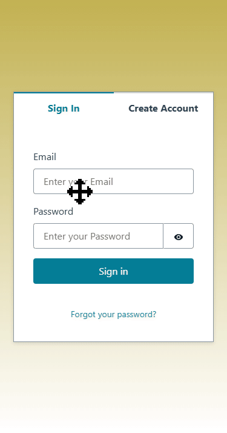

## Shared Shopping app

Full-stack serverless shopping list PWA built with Angular and AWS Amplify.
Supports authentication, localization, real-time data sync, and multi-device usage.

## Tech Stack

- Frontend: TypeScript, Angular, Ionic
- Backend: AWS lambda, DynamoDB, API Gateway, Amazon IAM
- Authorization: AWS Cognito
- Hosting: AWS Amplify
- DevOps / Tooling: GitHub Copilot

## Running the project
This project depends on AWS-managed services (Amplify, Cognito, Lambda).
For cost reasons, the backend infrastructure is not publicly deployed.

To run locally:
- Frontend can be started with `npm install` and `npm start`
- Backend requires an AWS account and Amplify configuration

## What I worked on
- Designed and implemented frontend components and managed application state using Angular and Ionic
- Implemented user authentication and integrated frontend with AWS APIs
- Developed serverless backend functions (AWS Lambda) for data manipulation
- Configured CI/CD with AWS Amplify

## Demo

